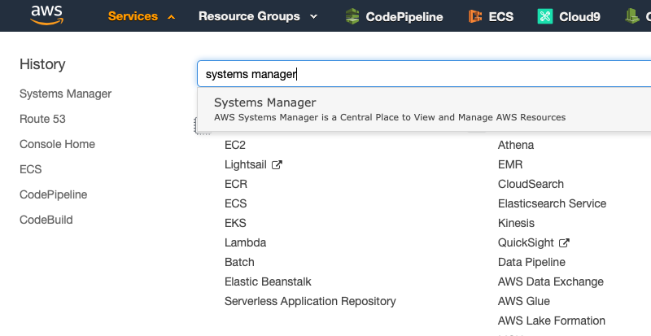
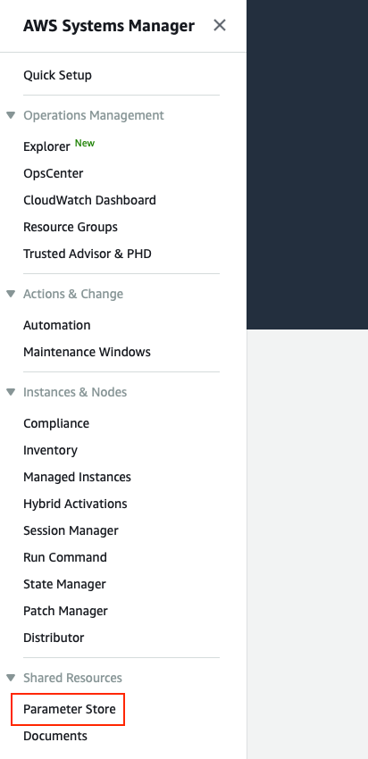
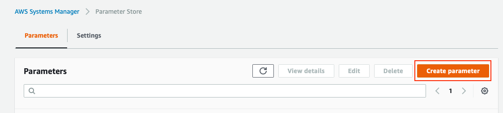
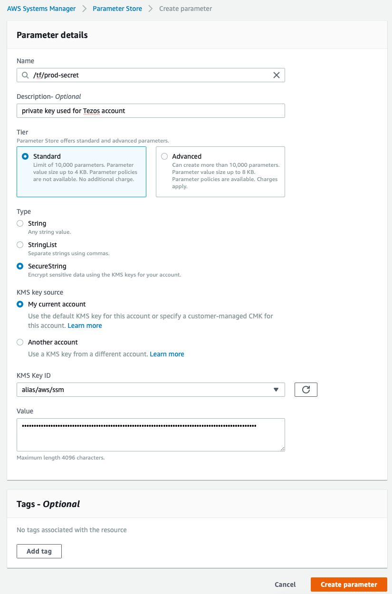

# Operation Broadcaster

## Introduction

This Serverless function can broadcast any operation on the Tezos blockchain, and uses a pre-funded account to pay for fees. This is useful because it enables developers to build applications that can generate signed operations, such as smart contract interactions, without having to worry about maintaining highly available Tezos nodes, and securing the private keys that are used to pay for fees.

This application was written by [Keefer Taylor](https://github.com/keefertaylor) with architectural guidance from [Luke Youngblood](https://github.com/lyoungblood).

## Required Components

In order to utilize this Serverless function, you'll need an AWS account. The cost to deploy and use this function should be minimal, and most usage likely falls into the free tier. You'll also need a local, compiled version of the `tezos-client` binary to generate accounts and operation payloads. Outside of that, it's assumed that you already have `npm` installed.

## Installation and Setup

1. First, check out this repository and perform an `npm install` to install all dependencies, including the Serverless framework, which is used to deploy this application.

2. Next, you'll need to generate a Tezos account using the `tezos-client`:
```shell
$ ./tezos-client gen keys testaccount
Warning:
  Failed to acquire the protocol version from the node
  Rpc request failed:
     - meth: GET
     - uri: http://localhost:8732/chains/main/blocks/head/protocols
     - error: Unable to connect to the node: "Connection refused"

$ ./tezos-client list known addresses
Warning:
  Failed to acquire the protocol version from the node
  Rpc request failed:
     - meth: GET
     - uri: http://localhost:8732/chains/main/blocks/head/protocols
     - error: Unable to connect to the node: "Connection refused"

testaccount: tz1UQ4yoykJxyBvqGnkk7xRcku4LTrn6nL3F (unencrypted sk known)
```
(you can ignore the warnings above, the account will still be created)

3. Next, you'll want to get the private key from the account:
```shell
$ cat ~/.tezos-client/secret_keys
[ { "name": "testaccount",
    "value":
      "unencrypted:edsk...key-is-here..." } ]
```

4. There is a 54 character private key seed which starts with `edsk`. Check out a copy of the [EzTz library](https://github.com/TezTech/eztz) and edit `src/main.js`. Add a line at the bottom of the file like this (replace the section in double quotes beginning with `edsk...` with the value from the `secret_keys` file in step 3:
```shell
$ git clone https://github.com/TezTech/eztz
Cloning into 'eztz'...
remote: Enumerating objects: 12, done.
remote: Counting objects: 100% (12/12), done.
remote: Compressing objects: 100% (9/9), done.
remote: Total 710 (delta 3), reused 9 (delta 3), pack-reused 698
Receiving objects: 100% (710/710), 2.69 MiB | 9.12 MiB/s, done.
Resolving deltas: 100% (366/366), done.
$ echo 'console.log(eztz.crypto.extractKeys("edsk..."));' >> src/main.js
$ node src/main.js 
{
  sk: 'edsk...',
  pk: 'edpk...',
  pkh: 'tz1...'
}
```

5. Now you should have a 98 character private key output in the `sk` field above. Take this key and you'll need to store it as a secret in AWS Systems Manager Parameter Store. Open the AWS console and navigate to Systems Manager (be sure to select the appropriate region first):


6. Next, click on _Parameter Store_ in the bottom left:



7. Next, click on _Create Parameter_:


8. Next, input the name of the parameter (these names are defined in the [serverless.yml](serverless.yml#L31-L32) file) with an optional description. You'll only need to use the _Standard_ tier, and _Type_ should be *SecureString*. You can leave the _KMS key source_ and _KMS Key ID_ at the default settings. Enter the 98 character `edsk...` value into the _Value_ field, then click _Create Parameter_:


9. Edit the [serverless.yml](template.yml#L10-17) file and customize anything you'd like to customize, such as the region you'll be deploying each stage to. The default file sets up two stages: `dev` and `prod`, so that you can have a dev version running on a testnet, and a prod version running on mainnet. You can configure this in the `provider` section:
```yaml
provider:
  name: aws
  apiKeys:
    - ${opt:stage,'dev'}
  runtime: nodejs10.x

  stage: ${opt:stage,'dev'}
  region: eu-west-1
```
This defines a `dev` and `prod` stage that are both in the `eu-west-1` region, along with an API key for each.

10. While editing [serverless.yml](template.yml#L26-L35) file, you'll also want to ensure that the `custom` variable section matches the stages you've defined in the `provider` section:
```yaml
custom:
  stages:
    - dev
    - prod
  ssmParameter:
    dev: "/tf/test-secret"
    prod: "/tf/prod-secret"
  nodeAddr:
    dev: "https://rpctest.tzbeta.net"
    prod: "https://rpc.tzbeta.net"
```
The default values above define the secret parameters as `/tf/test-secret` (for the `dev` stage) and `/tf/prod-secret` (for the `prod` stage), and also define Tezos node addresses. The `nodeAddr` values that are already in this file are the publicly available nodes provided by the Tezos Foundation. The operation will be broadcast through these nodes.

11. Run `npm install` to install Serverless framework along with the rest of the dependencies.

12. To deploy the `dev` stage, first make sure you have AWS credentials configured (install the AWS CLI and run `aws configure` and put in an access key and secret key that has the `AdministratorAccess` role attached), then execute `serverless deploy --stage dev`:
```shell
$ serverless deploy --stage dev
Serverless: Bundling with Webpack...
Time: 5340ms
Built at: 11/23/2019 4:16:40 PM
         Asset      Size  Chunks                   Chunk Names
    handler.js  1.23 MiB       0  [emitted]        handler
handler.js.map  2.74 MiB       0  [emitted] [dev]  handler
Entrypoint handler = handler.js handler.js.map
  [1] external "crypto" 42 bytes {0} [built]
 [14] ./node_modules/safe-buffer/index.js 1.49 KiB {0} [built]
 [30] external "path" 42 bytes {0} [built]
 [83] ./node_modules/web-request/index.js 6.68 KiB {0} [built]
 [84] ./node_modules/blakejs/index.js 395 bytes {0} [built]
 [85] ./node_modules/request/index.js 3.88 KiB {0} [built]
[196] ./node_modules/is-hex/is-hex.js 183 bytes {0} [built]
[197] ./node_modules/blakejs/blake2b.js 7.63 KiB {0} [built]
[198] ./node_modules/blakejs/blake2s.js 5.72 KiB {0} [built]
[199] ./node_modules/bs58check/index.js 300 bytes {0} [built]
[200] ./node_modules/create-hash/index.js 46 bytes {0} [built]
[201] ./node_modules/bs58check/base.js 1.17 KiB {0} [built]
[204] ./node_modules/libsodium-wrappers/dist/modules/libsodium-wrappers.js 67 KiB {0} [built]
[205] ./node_modules/libsodium/dist/modules/libsodium.js 485 KiB {0} [built]
[206] ./handler.ts + 6 modules 5.68 KiB {0} [built]
      | ./handler.ts 1.35 KiB [built]
      | ./lib/logger.ts 213 bytes [built]
      | ./lib/request-parser.ts 675 bytes [built]
      | ./lib/http-request-codes.ts 63 bytes [built]
      | ./lib/node-client.ts 1.2 KiB [built]
      | ./lib/signer.ts 1.45 KiB [built]
      | ./lib/utils.ts 760 bytes [built]
    + 192 hidden modules
Serverless: Packaging service...
Serverless: Uploading CloudFormation file to S3...
Serverless: Uploading artifacts...
Serverless: Uploading service blockscale.zip file to S3 (1.28 MB)...
Serverless: Validating template...
Serverless: Updating Stack...
Serverless: Checking Stack update progress...
..........
Serverless: Stack update finished...
Service Information
service: blockscale
stage: dev
region: eu-west-1
stack: blockscale-dev
resources: 13
api keys:
  dev: <snip>
endpoints:
  POST - https://<snip>.execute-api.eu-west-1.amazonaws.com/dev/sign
functions:
  sign: blockscale-dev-sign
layers:
  None
Serverless: Removing old service artifacts from S3...
Serverless: Run the "serverless" command to setup monitoring, troubleshooting and testing.
```
Notice that you'll get the API key and endpoint on the console output. Save these as you'll need them to use the API.

13. Deposit a small amount of Tezos into the address that you created earlier.

## Usage and Testing

You can use the following instructions to create an operation payload, sign it, and test it:

1. First, generate a signed operation payload by using the `tezos-client` with the `--dry-run` option:
```shell
$ ./tezos-client -l -A rpc.tzbeta.net -P 443 -S transfer 0.00001 from tz1... to tz1... --dry-run
<snip>
"signature":
        "edsigtnbF6eLuKszEQ7kqJmGCHZFh3NhuCCNGWXBYgoks2qfnLyb2BQFToLfwgjS6cYzcJBBvnqCmdLPz2GM4RFKkdHmxWqwecJ" } ]
Operation: 0x48e0557081272eac478ef0808ffd63c80ba8c9c864e99bb9611af415a6bd69066b00aad7200bcbbbcf8d26977fb153042865bc33edfdec09c4f98601904e0000839a7b29bb08405ff4bc731a4a3a5e45f59d96f80c262ec4a30f9289a6e7c4a16c00aad7200bcbbbcf8d26977fb153042865bc33edfda209c5f98601c350000a0000d4b265a4efc508aa6a4610969cd7fd249f9145ae007101109cd94e1af5119848e531c7ed29ddc37af88e3cb12f7d0b9595268a26885a0a56753d3b6548837d85292a0a21b1c7e04aa3ceadd3a749a2af84a0ff0908
Operation hash is 'onvMKeyoPcUAPyd9tMiJsjcEEoNt3Ybxmx5kpSEk572wYFMTzgp'
<snip>
```

2. Next, take everything in the `Operation` field after the 0x and put it in here:
```shell
$ node
Welcome to Node.js v12.12.0.
Type ".help" for more information.
> "48e0557081272eac478ef0808ffd63c80ba8c9c864e99bb9611af415a6bd69066b00aad7200bcbbbcf8d26977fb153042865bc33edfdec09c4f98601904e0000839a7b29bb08405ff4bc731a4a3a5e45f59d96f80c262ec4a30f9289a6e7c4a16c00aad7200bcbbbcf8d26977fb153042865bc33edfda209c5f98601c350000a0000d4b265a4efc508aa6a4610969cd7fd249f9145ae007101109cd94e1af5119848e531c7ed29ddc37af88e3cb12f7d0b9595268a26885a0a56753d3b6548837d85292a0a21b1c7e04aa3ceadd3a749a2af84a0ff0908".slice(0, -128)
'48e0557081272eac478ef0808ffd63c80ba8c9c864e99bb9611af415a6bd69066b00aad7200bcbbbcf8d26977fb153042865bc33edfdec09c4f98601904e0000839a7b29bb08405ff4bc731a4a3a5e45f59d96f80c262ec4a30f9289a6e7c4a16c00aad7200bcbbbcf8d26977fb153042865bc33edfda209c5f98601c350000a0000d4b265a4efc508aa6a4610969cd7fd249f9145ae00'
```

3. Now, take the output of the slice, remove the single quotes, and put it inside double quotes, injecting the operation using `curl`:
```shell
$ curl -X POST \
https://<snip>.execute-api.eu-west-1.amazonaws.com/prod/sign \
-H 'Content-Type: application/json' \
-H 'x-api-key: <api-key>' \
-d '{"op": "48e0557081272eac478ef0808ffd63c80ba8c9c864e99bb9611af415a6bd69066b00aad7200bcbbbcf8d26977fb153042865bc33edfdec09c4f98601904e0000839a7b29bb08405ff4bc731a4a3a5e45f59d96f80c262ec4a30f9289a6e7c4a16c00aad7200bcbbbcf8d26977fb153042865bc33edfda209c5f98601c350000a0000d4b265a4efc508aa6a4610969cd7fd249f9145ae00"}'
ootEYwJPFfWXsx7VwixsnmhbkWd5BfxmFZG4eDhLZ3AeHD26TYT
```
Be sure to replace the `<api-key` in the `x-api-key` header with the API key that was returned by the `serverless deploy`. The operation hash that is returned (in this example `ootEYwJPFfWXsx7VwixsnmhbkWd5BfxmFZG4eDhLZ3AeHD26TYT`) is the hash generated by the Tezos node upon successful injection of the operation. You can search for it in any Tezos block explorer, and it should be available in 1 minute or less (depending on how fast the operation is included in a block on the Tezos network).